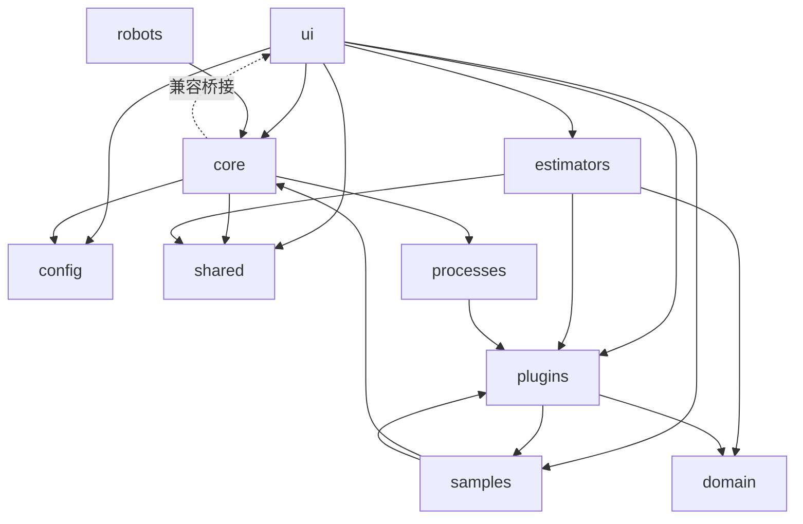

# UR Print FDM 架构健康度分析报告（rev-4）

**复核日期**：2026年3月8日  
**项目版本**：0.1.1 (`ur-print-fdm`)  
**范围**：`ur_print_fdm/` 主包 + `ur_print_fdm/tests`

---

## 0. 结论

你要求的中优先级修正已完成，当前状态从“部分收敛”升级到“关键中优项已闭环”。  

**健康度评分：84 / 100**（rev-3 为 78 / 100）

主要增益：

1. `RunController` 从“调用主窗口私有方法”改为“自包含编排 + 公共接口回调”。  
2. 插件内建注册不再静态导入具体实现，改为字符串规格 + 动态加载。  
3. `script_sanitizer` 下沉到 `shared`，`estimators -> core` 依赖已切断。  
4. `main_window.py` 体量进一步下降到 `2169` 行（之前 `2277`）。  

---

## 1. 优先级问题状态

### 1.1 高优先级（已完成）

| 问题 | 状态 | 证据 |
|---|---|---|
| `send_script` 失败被误判成功 | `已修复` | `ur_print_fdm/robots/ur_backend.py:41-46` |
| 后端 `send_script` 契约不一致 | `已修复` | `ur_print_fdm/robots/contracts.py:17,29` |
| 高优回归用例不足 | `已修复（最小集）` | `ur_print_fdm/tests/test_ur_backend_send_script.py` |

### 1.2 中优先级（本轮完成）

| 问题 | 状态 | 证据 | 说明 |
|---|---|---|---|
| `RunController` 依赖主窗口私有方法 | `已修复` | `ur_print_fdm/ui/controllers/run_controller.py:63,128,195,222,291` | 关键保存/启动/停止编排下沉到控制器；回调优先公共接口。 |
| 主窗口缺少公共编排接口 | `已修复` | `ur_print_fdm/ui/main_window.py:1159,1678,1733,1756,1803,1816,1830` | 新增 `on_*` 与 `start_*` 公共 facade。 |
| 插件层静态耦合实现类 | `已修复` | `ur_print_fdm/plugins/builtin.py:8,16,22` | 改为 `_BUILTIN_PLUGIN_SPECS` + `_load_object()` 动态加载。 |
| 解环起步（`estimators -> core`） | `已修复` | `ur_print_fdm/estimators/urscript.py:7`、`ur_print_fdm/shared/script_sanitizer.py:8` | 工具下沉到 `shared`，并保留 `core` 兼容入口。 |
| 兼容迁移可追踪性 | `已修复` | `ur_print_fdm/core/script_sanitizer.py:8` | 旧入口增加弃用告警，平滑迁移。 |

---

## 2. 当前依赖关系（修订后）

> 相比 rev-3：`estimators -> core` 已移除，`plugins` 不再静态依赖 `estimators/processes/robots` 实现模块。

---

## 3. 尚未完成的重点（下一阶段）

1. **主窗口进一步瘦身**  
`main_window.py` 仍为 `2169` 行，建议继续拆“连接控制”和“上传流程”。

2. **继续解环**  
当前依赖图仍存在较大强连通分量，下一步优先处理 `samples -> core` 的历史耦合。

3. **测试与 CI**  
已新增单测，但当前环境仍缺 `pytest`；仓库暂无 `.github/workflows`。

---

## 4. 本轮新增测试

| 文件 | 覆盖点 |
|---|---|
| `ur_print_fdm/tests/test_plugins_builtin.py` | 动态对象加载、内建插件注册结果 |
| `ur_print_fdm/tests/test_run_controller.py` | 运行/停止路由行为（生产、直连） |

---

## 5. 关键证据索引

| 文件 | 行号 | 结论 |
|---|---|---|
| `ur_print_fdm/ui/controllers/run_controller.py` | 63,128,195,222,291 | RunController 已自包含关键编排逻辑 |
| `ur_print_fdm/ui/main_window.py` | 1159,1678,1733,1756,1803,1816,1830 | 主窗口新增公共 facade，供控制器调用 |
| `ur_print_fdm/plugins/builtin.py` | 8,16,22 | 插件注册改为动态加载模型 |
| `ur_print_fdm/shared/script_sanitizer.py` | 8 | sanitizer 下沉到 shared |
| `ur_print_fdm/core/script_sanitizer.py` | 5,8 | 兼容转发 + deprecation |
| `ur_print_fdm/estimators/urscript.py` | 7 | 不再依赖 `core.script_sanitizer` |
| `ur_print_fdm/core/driver.py` | 13 | 改用 shared sanitizer |
| `ur_print_fdm/tests/test_plugins_builtin.py` | 全文 | 插件动态注册回归 |
| `ur_print_fdm/tests/test_run_controller.py` | 全文 | 控制器路由回归 |

---

*文档版本：rev-4（覆盖 rev-3）。*  
*说明：本报告基于当前工作区代码状态生成。*
